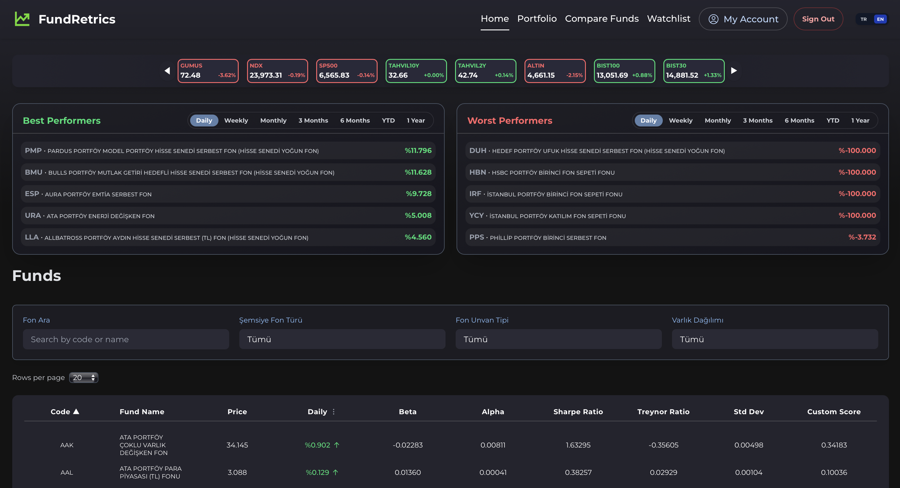
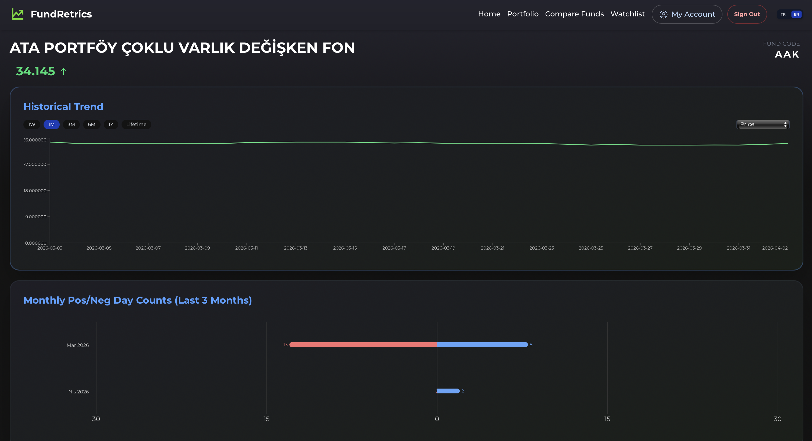
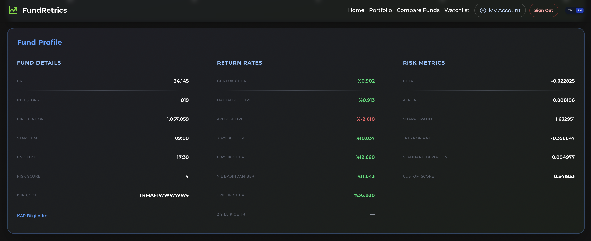
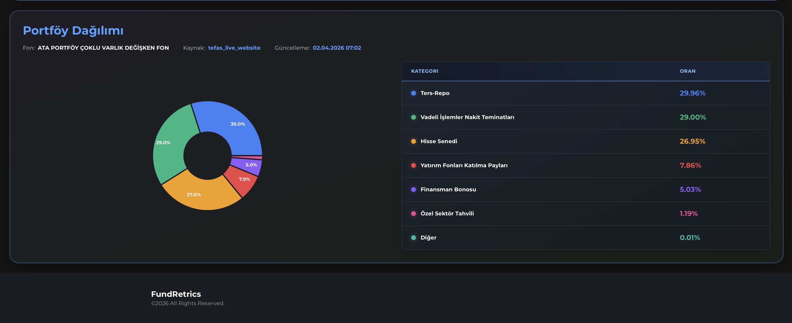
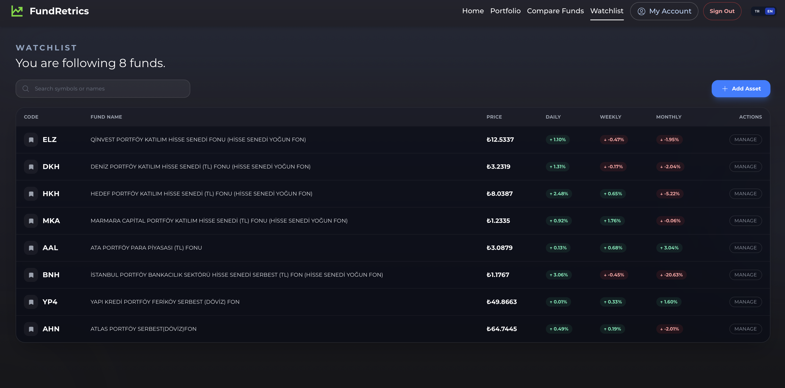
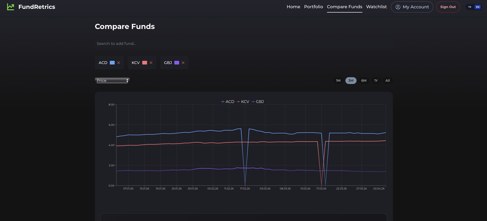
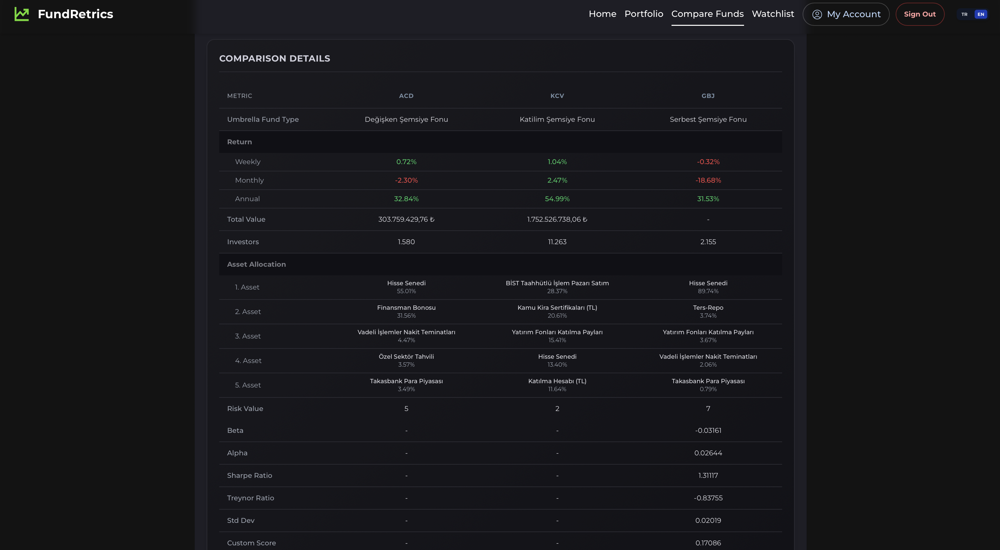
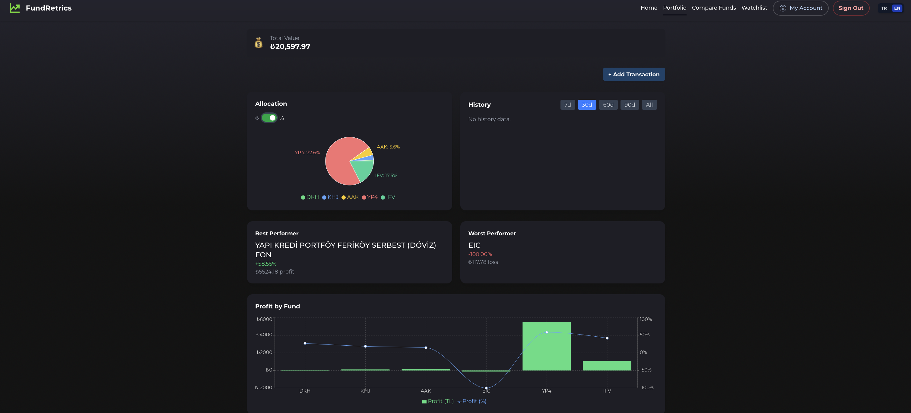
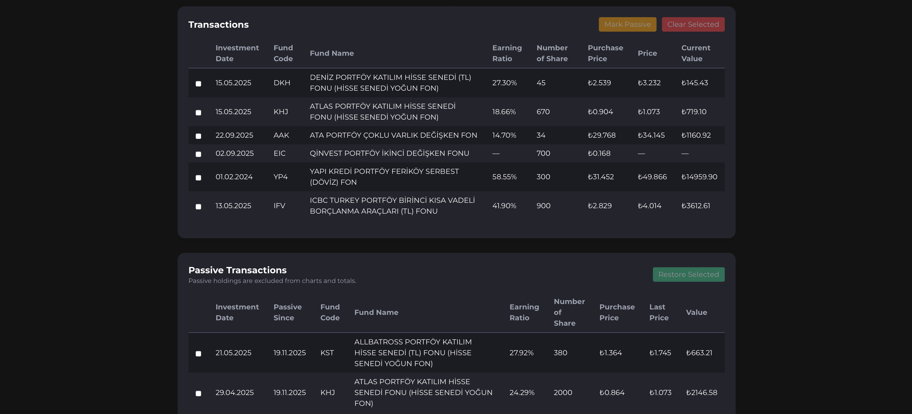
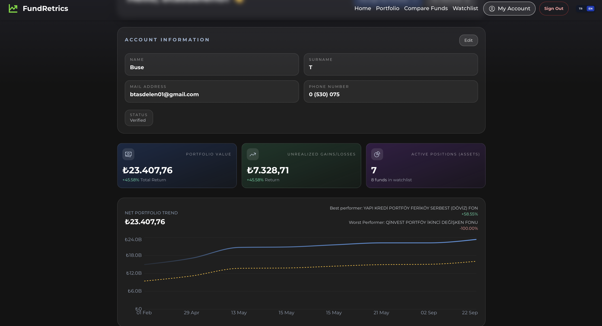

# FundRetrics

> Advanced Mutual Fund Analytics Platform for Turkish Markets

FundRetrics is a full-stack fintech analytics platform designed to provide deeper insight into Turkish mutual funds by combining automated data pipelines, quantitative risk analysis, portfolio breakdowns, and interactive visualizations.

- This repository is intended for technical reviewers.

---

## Core Features

### Financial Analytics
- Volatility Analysis
- Multi-period Return Tracking

### Automated Data Infrastructure
- Automated TEFAS scraping
- Historical market data processing
- ETL pipeline architecture
- Scheduled cloud-based updates

---
## Overview

Traditional fund platforms mainly focus on displaying raw fund information and basic historical returns. FundRetrics extends this by introducing:

- Automated financial data pipelines
- Quantitative risk analytics
- Custom scoring systems
- Portfolio distribution analysis
- Historical performance tracking
- Real-time fund monitoring infrastructure

The project was developed as a fintech-focused software engineering initiative combining:

- backend engineering
- cloud infrastructure
- data engineering
- financial analytics

---

## Quantitative Fund Analytics

FundRetrics calculates advanced financial metrics including:

- Beta
- Alpha
- Sharpe Ratio
- Treynor Ratio
- Daily / Weekly / Monthly Returns
- YTD Performance
- Multi-period performance tracking
- **Custom composite scoring system**

---

## System Architecture

### Frontend
- React.js
- Tailwind CSS
- Vite
- Interactive charts & analytics dashboards

### Backend
- Python
- Flask
- Async scraping architecture
- Financial calculation engine

### Database
- Google Firestore

### Cloud Infrastructure
- Docker
- Google Cloud Run § Scheduler

---

## Financial Analytics Engine

The analytics layer performs:

### Return Calculations

### Risk Metrics
- Beta
- Volatility
- Sharpe Ratio
- Treynor Ratio
- Alpha

### Portfolio Insights
- Asset allocation analysis
- Portfolio category extraction
- Fund composition tracking

---

## Tech Stack

| Area | Technologies |
|---|---|
| Full-Stack Development | React, Flask, REST APIs |
| Cloud Engineering | Cloud Run, Docker, Cron Job Scheduler |
| Data Engineering | ETL Pipelines |
| Financial Engineering | Risk Metrics, Quant Analytics |
| DevOps | Deployment Automation, Logging |
| Web Scraping | BeautifulSoup |
| Database Design | Firestore NoSQL Architecture |

---

## Project Goals

FundRetrics is built to explore how modern software engineering and cloud infrastructure can be combined with financial analytics to produce a scalable mutual fund intelligence platform.

The long-term goal is to evolve the system into:

- a broader investment analytics ecosystem
- a portfolio intelligence platform
- a more advanced quantitative analysis environment for retail investors

## Screenshots

### Dashboard/Home Page

  

### Fund Analysis Page

  

  

  

### Watchlist

  

### Compare Funds

  

  

### Portfolio

  

  

### User Dashboard

 

  

